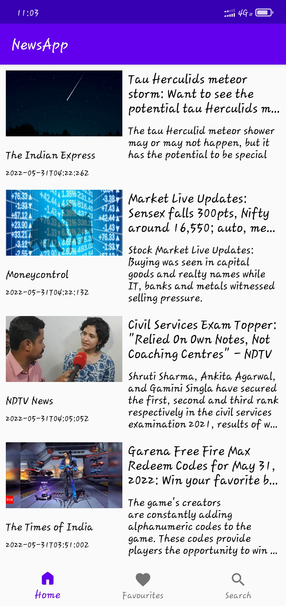
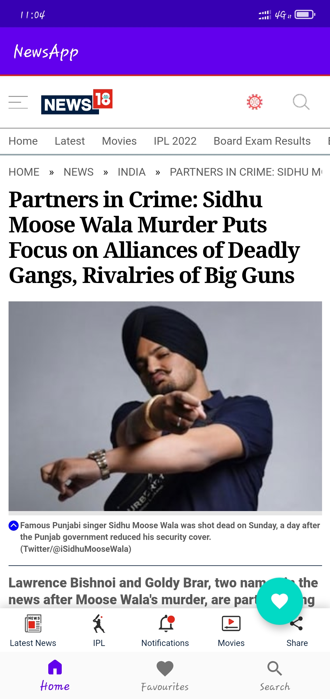
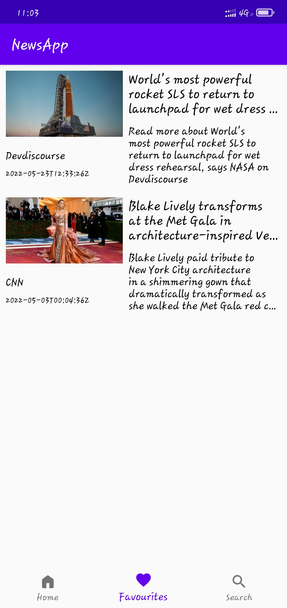
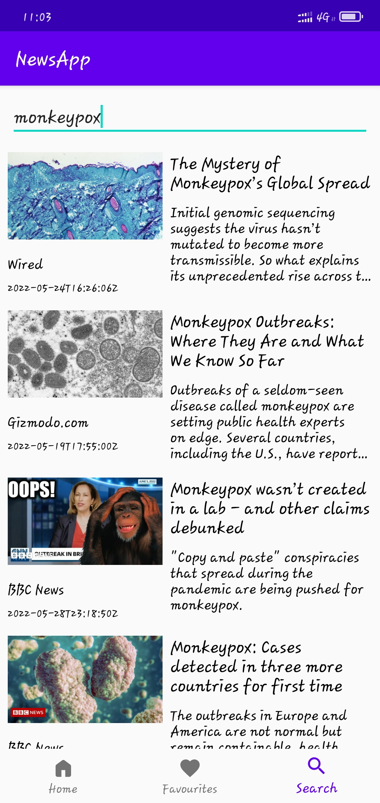

# NewsApp
An android application that lets users view and scroll through the latest breaking news in India. Users can share articles to friends and save any article for future reference and also can search for news worldwide.
## Tech Stacks Used
- Retrofit2 library
- Room library
- Coroutines
- MVVM Architecture
## User Interface
   
